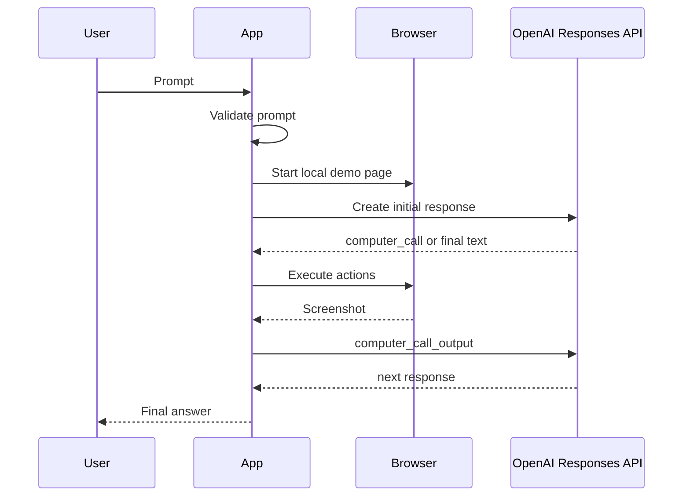

# Flow

```text
prompt
  -> validation
  -> initial response
  -> computer_call
  -> execute actions
  -> screenshot
  -> computer_call_output
  -> next response
  -> final text
```


```mermaid
sequenceDiagram
    participant User
    participant App
    participant Browser
    participant API as OpenAI Responses API

    User->>App: Prompt
    App->>App: Validate prompt
    App->>Browser: Start local demo page
    App->>API: Create initial response
    API-->>App: computer_call or final text
    App->>Browser: Execute actions
    Browser-->>App: Screenshot
    App->>API: computer_call_output
    API-->>App: next response
    App-->>User: Final answer
```
